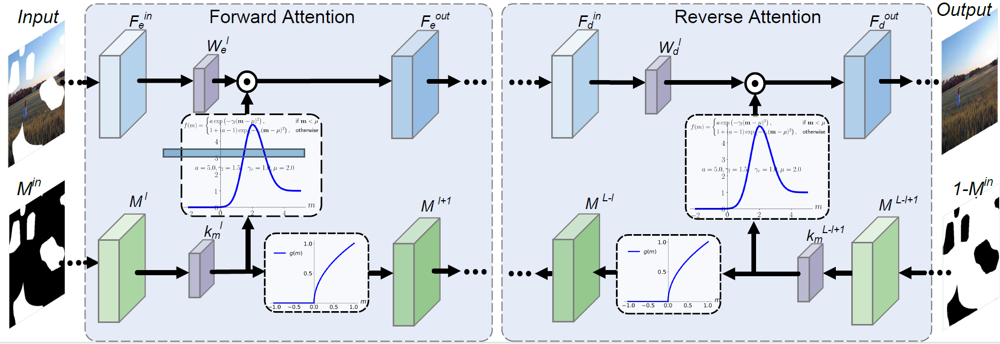

# LBAM_inpainting

## Introduction
This is the pytorch implementation of Paper: Image Inpainting With Learnable Bidirectional Attention Maps (ICCV 2019) [paper](http://openaccess.thecvf.com/content_ICCV_2019/papers/Xie_Image_Inpainting_With_Learnable_Bidirectional_Attention_Maps_ICCV_2019_paper.pdf) [suppl](http://openaccess.thecvf.com/content_ICCV_2019/supplemental/Xie_Image_Inpainting_With_ICCV_2019_supplemental.pdf)

### Model Architecture
We propose a Bidirectional Attention model based on the [U-Net](https://arxiv.org/pdf/1611.07004.pdf) architecture.


### Bidrectional Attention Layer


## Prerequisites
- Python 3.6
- Pytorch >= 1.0 (tested on pytorch version 1.0.0, 1.2.0, 1.3.0)
- CPU or NVIDIA GPU + Cuda + Cudnn

### Training
To train the LBAM model:
```bash
python train.py --batchSize numOf_batch_size --dataRoot your_image_path \
--maskRoot your_mask_root --modelsSavePath path_to_save_your_model \
--logPath path_to_save_tensorboard_log --pretrain(optional) pretrained_model_path
```

### Testing
To test the model:
```bash
python test.py --input input_image --mask your_mask --output output_file_prefix --pretrain pretrained_model_path
```

To test with random batch with random masks:
```
python test_random_batch.py --dataRoot your_image_path
--maskRoot your_mask_path --batchSize numOf_batch_size --pretrain pretrained_model_path
```

### Some Results
We suggest that you train our model with a large batch size (>= 48 or so). We re-train our model with batch size 10, the results degrades a little bit, I guess it may be due to the batch-normalization opreation (I would try removing bn from LBAM and see how it affects).

Here are some inpainting results that we train with batch size of 10 on Paris StreetView dataset:
<table style='float:center'>
 <tr>
  <th><B>Input</B></th> <th><B>Results</B></th> <th><B>Ground-Truth</B></th>
 </tr>

<tr>
    <td>
     
    </td>
    <td>
     
    </td>
    <td>
     
    </td>

</tr>

<tr>
    <td>
     
    </td>
    <td>
     
    </td>
    <td>
     
    </td>

</tr>

<tr>
    <td>
     
    </td>
    <td>
     
    </td>
    <td>
     
    </td>

</tr>

<tr>
    <td>
     
    </td>
    <td>
     
    </td>
    <td>
     
    </td>

</tr>

<tr>
    <td>
     
    </td>
    <td>
     
    </td>
    <td>
     
    </td>

</tr>


</table>


### If you find this code would be useful
Please cite our paper

```
@InProceedings{Xie_2019_ICCV,
author = {Xie, Chaohao and Liu, Shaohui and Li, Chao and Cheng, Ming-Ming and Zuo, Wangmeng and Liu, Xiao and Wen, Shilei and Ding, Errui},
title = {Image Inpainting With Learnable Bidirectional Attention Maps},
booktitle = {The IEEE International Conference on Computer Vision (ICCV)},
month = {October},
year = {2019}
}
```


### Acknowledgement
We benifit a lot from [NVIDIA-partialconv](https://github.com/NVIDIA/partialconv) and [naoto0804-pytorch-inpainting-with-partial-conv](https://github.com/naoto0804/pytorch-inpainting-with-partial-conv
), thanks for their excellent work.